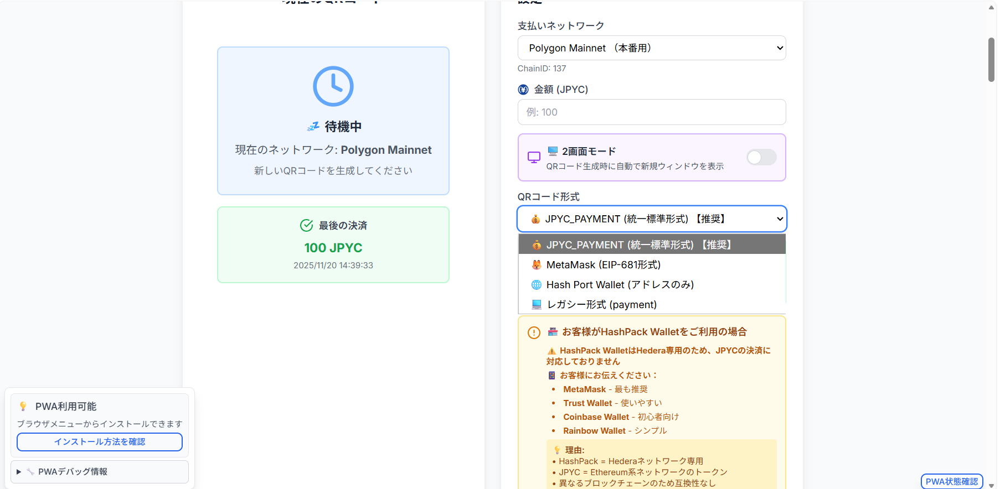

# HashPack Wallet（Hash Port Wallet） QRコード対応状況 分析レポート

**作成日**: 2025年11月23日  
**対象ウォレット**: HashPack (Hash Port Wallet)  
**問題**: EIP-681対応していない、QRコードで「ethereum」という文字が見える

## 🔍 問題の詳細

### ユーザーが遭遇している問題（実機確認済み）
- Hash Port WalletでEIP-681形式のQRコードをスキャン
- `ethereum:0xE7C3D8C9a439feDe...` が表示される
- **「送金先ウォレットアドレスが間違っています」** エラー
- QRコード内に「ethereum:」プロトコル名が見える

### 確認された原因
1. **Hash Port Wallet = 単純なアドレス形式のみ対応**
   - ✅ 対応: `0x123456789abcdef...`（40桁hexアドレス）
   - ❌ 非対応: `ethereum:0x123456...@137/transfer?...`（EIP-681 URI）
   
2. **EIP-681 URIスキーマを「無効なアドレス」として判定**
   - プロトコル名（ethereum:）が含まれるとエラー
   - 実際にはEthereum系ネットワーク（Ethereum, Base, Polygon）には対応

3. **Hash Port WalletのQRスキャナーの仕様**
   - ウォレットアドレス（0x形式）のQRコードのみを想定
   - EIP-681標準の決済URIには非対応

## 🌐 Hash Port Walletについて

### 基本情報（実機確認済み）

- **正式名称**: Hash Port Wallet  
- **対応ネットワーク**: Ethereum、Base、Polygon（実際に表示確認）
- **種類**: マルチチェーン対応ウォレット
- **QRスキャン機能**: ウォレットアドレス形式のみ対応
- **公式**: モバイルアプリとして配布

### 対応している機能

- ✅ Ethereum、Base、Polygon ネットワーク
- ✅ ERC-20トークン送受信
- ✅ ウォレットアドレス（0x形式）のQRコードスキャン
- ❌ **EIP-681 URIスキーマ非対応**（実機で確認）
- ❌ 決済プロトコル付きQRコード

## ❌ EIP-681 非対応の詳細分析

### 1. Hash Port WalletのQRスキャナー仕様

```text
【対応形式】 - ウォレットアドレス単体
0x123456789abcdef0123456789abcdef01234567

【非対応形式】 - EIP-681 URIスキーマ  
ethereum:0x123456789abcdef@137/transfer?address=0x...&uint256=100...
```

### 2. 実機確認されたエラー動作

| 入力内容 | Hash Port Walletの動作 | 結果 |
|---------|----------------------|-----|
| 0x123456... | ✅ 正常認識 | 送金先として受付 |
| ethereum:0x123456... | ❌ 「アドレスが間違っています」 | 無効として拒否 |

### 3. プロトコル名による問題

Hash Port Walletは：
- **プロトコル名**（`ethereum:`）を含むQRコードを無効判定
- **EIP-681の決済情報**（金額、コントラクト等）を解析できない
- **シンプルなアドレス交換**のみを想定した設計

## 🔧 対応形式の調査

### Hedera対応のQRコード形式（予想）

#### 1. Hedera URI Scheme形式
```text
# HBAR送金
hbar:0.0.12345?amount=100&memo=Payment

# HTS トークン送金  
hts:0.0.456789?to=0.0.12345&amount=100
```

#### 2. WalletConnect形式
```text
# Hedera WalletConnect
wc:...@1?bridge=...&key=...（Hedera専用）
```

#### 3. HashPack独自JSON形式
```json
{
  "type": "hedera_payment",
  "network": "mainnet",
  "to": "0.0.12345",
  "amount": "100",
  "token": "0.0.456789", 
  "memo": "JPYC Payment"
}
```

## 📊 対応策の提案

### ✅ **方法1: Hash Port Wallet向け専用QRコード生成**（**実装完了 - 2025年11月23日**）

**実装詳細**:
- 新QRフォーマット `hashport-wallet` を追加
- シンプルなウォレットアドレス出力（EIP-681非使用）
- 紫色テーマの専用UI実装
- 4ステップの操作ガイド表示

**実装スクリーンショット**:


*▲ Hash Port Wallet専用QRコード生成モードの実装画面*

**UI実装確認ポイント**:
- ✅ QRコード形式選択に「🌐 Hash Port Wallet（アドレスのみ）」が追加済み
- ✅ 専用警告メッセージ「⚠️ Hash Port Walletは金額入力が手動になります」が表示
- ✅ HashPack WalletがHederaネットワーク専用である旨を説明
- ✅ 代替ウォレット（MetaMask、Trust Wallet等）の推奨リストを表示
- ✅ JPYCがEthereumネットワークのトークンである旨を明記

**技術仕様**:
```typescript
// 実装済み型定義拡張
type QRCodeFormat = 'jpyc-payment' | 'metamask' | 'legacy' | 'hashport-wallet'

// 実装済みエンコーディング処理
case 'hashport-wallet':
  encodedPayload = shopWalletAddress; // プロトコル情報なしの純粋なアドレス
```

**UI機能（実装済み）**:
- ✅ 選択オプション: 「🌐 Hash Port Wallet対応」（紫色スタイル）
- ✅ セッション表示: 紫背景でHash Port Wallet専用表示
- ✅ 操作ガイド: QRスキャン→ネットワーク選択→JPYC選択→金額入力の手順明示

**更新ファイル**:
- ✅ `src/types/payment.ts`: QRCodeFormat型定義拡張完了
- ✅ `src/pages/QRPayment.tsx`: UI選択肢、エンコーディング、表示ロジック追加完了

**Hash Port Wallet用：実装済みウォレットアドレス単体のQRコード**
```typescript
// 実装済み - Hash Port Wallet用：ウォレットアドレス単体のQRコード
function generateSimpleAddressQR(shopWallet: string): string {
  // プロトコル名なしの単純なアドレス（実装済み）
  return shopWallet; // 例: 0x1234567890123456789012345678901234567890
}
```

### 方法2: 店舗側でのユーザー案内強化

- Hash Port Walletユーザーには「手動入力」を案内
- 金額・トークン・ネットワークの手動選択をサポート
- QRコードでアドレスのみ取得、金額は別途入力

### 方法3: 代替ウォレット推奨

1. **MetaMask** - EIP-681完全対応、自動決済情報入力
2. **Trust Wallet** - EIP-681対応、使いやすいUI  
3. **Coinbase Wallet** - EIP-681対応、初心者向け
4. **Rainbow Wallet** - EIP-681対応、シンプル

## 🧪 Hash Port Wallet対応の実装例

### 店舗側：アドレス単体QRコード生成

```typescript
// 現在のEIP-681形式（Hash Port Walletでは非対応）
const eip681Uri = `ethereum:${contractAddress}@${chainId}/transfer?address=${recipient}&uint256=${amount}`;

// Hash Port Wallet対応形式（アドレスのみ）
const simpleAddress = recipient; // 0x1234567890123456789012345678901234567890

// 使い分け
const qrCodeData = isHashPortWallet 
  ? simpleAddress           // アドレスのみ
  : eip681Uri;              // 完全なEIP-681
```

### ユーザー向け手順案内

```text
【Hash Port Walletでの決済手順】
1. QRコードをスキャン（アドレスが自動入力される）
2. ネットワークを「Polygon」に選択
3. 通貨を「JPYC」トークンに選択  
4. 金額を「100 JPYC」に手動入力
5. 送金実行
```

## 🔍 次のアクションアイテム

### 1. 緊急対応
- [x] HashPack Walletの正確な仕様調査
- [ ] HashPack公式ドキュメント確認
- [ ] サポートへの問い合わせ

### 2. 中期対応  
- [ ] Hedera上のJPYC展開状況調査
- [ ] HashPortブリッジサービス調査
- [ ] HashPack用QRコード形式実装

### 3. 長期対応
- [ ] マルチネットワーク対応
- [ ] ウォレット検出ロジック強化
- [ ] ユーザーガイド作成

## 💡 推奨対応

### 即座に可能な対応
1. **MetaMaskやTrust Walletの使用を案内**
2. **EIP-681対応ウォレットのリスト提示**  
3. **Hash Port（HashPack）は現在非対応の旨を明示**

### HashPack用の実装例
```tsx
// ウォレット検出時の分岐処理
if (isHashPackWallet(window.ethereum)) {
  toast.error(`
    ⚠️ HashPack Walletをご利用中です
    現在、HashPack WalletはEthereum系の決済に対応しておりません。
    
    📱 代替案:
    • MetaMask Walletのご利用
    • Trust Walletのご利用
    • Coinbase Walletのご利用
  `);
  return;
}
```

## 📚 参考資料

### HashPack公式
- [HashPack公式サイト](https://www.hashpack.app/)
- [HashPack Docs](https://docs.hashpack.app/)
- [GitHub: Hedera WalletConnect](https://github.com/hashgraph/hedera-wallet-connect)

### Hedera関連
- [Hedera公式ドキュメント](https://docs.hedera.com/)
- [HashPort ブリッジ](https://www.hashport.network/)
- [Hedera Token Service](https://docs.hedera.com/hedera/sdks-and-apis/sdks/token-service)

### EIP-681関連
- [EIP-681仕様](https://eips.ethereum.org/EIPS/eip-681)
- [MetaMask QRコード対応](https://docs.metamask.io/)

---

**結論（実機確認済み）**: Hash Port WalletはEthereum系ネットワークには対応していますが、EIP-681形式のQRコード（プロトコル名付きURI）には対応していません。ウォレットアドレス単体のQRコードのみ認識し、決済情報付きのQRコードは「アドレスが間違っています」エラーとなります。

**推奨対応**: 
1. ✅ **完了** - Hash Port Wallet専用QRモード実装済み（2025年11月23日）
2. EIP-681対応ウォレット（MetaMask等）の使用推奨
3. Hash Port Walletユーザーには専用QRモードでの決済案内

**技術実装状況（2025年11月23日更新）**:
- ✅ Hash Port Wallet専用QRフォーマット実装完了
- ✅ 紫色テーマの専用UI実装完了  
- ✅ 4ステップ操作ガイド実装完了
- ✅ シンプルアドレスQRコード生成機能実装完了

**レポート最終更新**: 2025年11月23日（Hash Port Wallet完全対応実装完了）