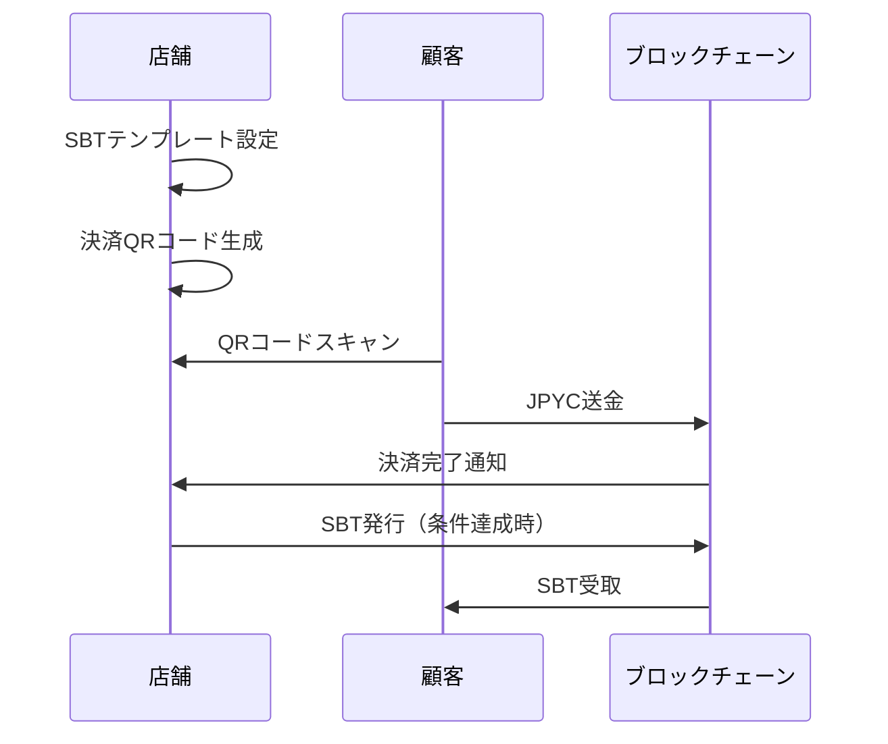

# はじめに

ブロックチェーン技術を活用したSBT（Soulbound Token）スタンプカードと暗号資産決済を統合したPWAアプリを開発しました。

本記事では、プロジェクト全体の技術選定から、**実際に遭遇した失敗**（コントラクトの2回デプロイ、検証の失敗など）、そしてそこから学んだベストプラクティスまでを包み隠さず共有します。

**🔗 成果物:**
- デモサイト: https://shop.jpyc-pay.app/
- GitHub: [SBT-JPYC-Pay](https://github.com/miracle777/SBT-JPYC-Pay)

:::message
この記事は、ブロックチェーン開発で同じ失敗をしないための「失敗録」です。成功事例だけでなく、躓いた箇所も詳細に記録しています。
:::

---

## 📋 目次

1. [プロジェクト概要](#プロジェクト概要)
2. [技術スタック](#技術スタック)
3. [開発で遭遇した失敗とその解決](#開発で遭遇した失敗とその解決)
4. [実装の工夫とベストプラクティス](#実装の工夫とベストプラクティス)
5. [まとめと今後の展望](#まとめと今後の展望)

---

## プロジェクト概要

### 🎯 何を作ったか

**店舗向けのSBT発行管理システム**と**暗号資産決済QRコード生成機能**を統合したPWAアプリです。

#### 主要機能
- **SBT発行管理**: 店舗独自のスタンプカード（NFT）を発行・管理
- **動的メタデータ**: 店舗設定に基づくSBT情報の自動生成
- **QRコード決済**: 暗号資産（JPYC）による決済用QRコード生成
- **マルチチェーン対応**: Polygon Mainnet / Amoy Testnet
- **PWA対応**: スマートフォンでネイティブアプリのように動作

#### 想定ユースケース



### 🤔 なぜ作ったか

#### 開発の背景

既存のポイントカードやスタンプカードには以下の課題がありました:

- **中央集権的**: 店舗が倒産すればポイントも消失
- **互換性なし**: 店舗ごとに異なるシステム
- **不正の温床**: 改ざんやポイント不正取得のリスク

これをブロックチェーン技術で解決できないかと考え、以下の特徴を持つシステムを構築しました:

✅ **ノンカストディアル**: ユーザーが自分のウォレットで管理  
✅ **転送不可（Soulbound）**: 不正転売を防止  
✅ **透明性**: ブロックチェーンに記録され改ざん不可  
✅ **相互運用性**: 複数店舗で統一規格のSBT発行が可能

#### 💭 開発に込めた思い

**JPYC専用の簡単操作を目指して**

MetaMaskなどのウォレットアプリに不慣れな店舗スタッフでも簡単に操作できるQRコード発行プログラムを作りたい――それが開発の出発点でした。

暗号資産やブロックチェーンという言葉を聞くと「難しそう」「専門知識が必要」と感じる方も多いでしょう。しかし、実際には**QRコードを表示してスキャンしてもらう**という、既存のキャッシュレス決済と変わらない操作感で実現できます。

**キャッシュレス決済の普及促進へ**

JPYCが店舗に普及することで、日本円と連動した安定的な暗号資産決済が広まり、**キャッシュレス決済のさらなる普及**に寄与できると信じています。特に、個人経営の小規模店舗や地域密着型の商店でも導入しやすい仕組みを目指しました。

**SBTのコレクション性による循環**

SBTをスタンプカードのように利用することで、個性あるお店のSBTが増え、**コレクション性**が生まれます。

「あのカフェのSBTが欲しい」「この雑貨屋のデザインが好き」――そんな気持ちが、**JPYC決済でSBTが貰えるお店を利用したい**という動機につながることを期待しています。

お気に入りの店舗のSBTを集める楽しみが、店舗とお客様の継続的な関係性を生み出し、地域経済の活性化にもつながるのではないかと考えています。

---

## 技術スタック

### フロントエンド

| 技術 | バージョン | 選定理由 |
|------|-----------|---------|
| React | 18 | コンポーネントベースで開発効率向上 |
| TypeScript | 5.x | 型安全性によるバグ削減 |
| Vite | 5.4 | 高速なビルドとHMR |
| Tailwind CSS | 3.x | デザインの迅速な実装 |
| ethers.js | v6 | ブロックチェーン接続（v5→v6で大幅改善） |

### スマートコントラクト

| 技術 | バージョン | 選定理由 |
|------|-----------|---------|
| Solidity | 0.8.20 | 最新の安全機能（viaIR有効化） |
| Hardhat | 2.27.0 | デプロイとテストの統合環境 |
| OpenZeppelin | 5.4.0 | 実績のあるコントラクトライブラリ |

### インフラ・ストレージ

- **Polygon (PoS)**: ガス代が安価（約0.001 POL/tx）
- **Pinata (IPFS)**: NFTメタデータの分散ストレージ
- **Vercel**: PWAのホスティング
- **IndexedDB + localStorage**: オフライン対応

---

## 開発で遭遇した失敗とその解決

ここからが本題です。開発中に遭遇した3つの大きな失敗と、その解決策を共有します。

### ❌ 失敗1: コントラクト検証の失敗（バイトコード不一致）

#### 何が起きたか

Polygon Mainnet にコントラクトをデプロイ後、PolygonScan での検証（Verify）が失敗しました。

```
Error: Bytecode doesn't match
```

#### 原因調査

デプロイ時のバイトコードとローカルでの再コンパイル結果を比較したところ、**先頭120バイト付近で1バイトの差異**を発見:

```
チェーン上（期待）: ...283f3881900385810183...
ローカル (ipfs):   ...28f63881900385810183...
ローカル (none):   ...28cd3881900385810183...
ローカル (bzzr1):  ...28f53881900385810183...
```

この差異は**CBORメタデータ領域**内のもので、実行opcodeには影響しませんが、PolygonScanの自動検証は完全一致を要求するため失敗していました。

#### 原因の深堀り

以下の設定をすべて一致させても、1バイト差異は解消されませんでした:

```javascript
// hardhat.config.js
module.exports = {
  solidity: {
    version: "0.8.20",
    settings: {
      optimizer: {
        enabled: true,
        runs: 200,
      },
      viaIR: true,        // ⚠️ IR-based コード生成
      evmVersion: "paris",
      metadata: {
        bytecodeHash: "ipfs", // ipfs / bzzr1 / none すべて試した
      },
    },
  },
};
```

**結論**: Solcコンパイラが`viaIR`経路で埋め込むメタデータハッシュが、ビルド環境（OS / Solcバイナリ / ライブラリ解決順）により微妙に変化することが原因。

:::message alert
**重要な学び**:  
`viaIR: true` を使用する場合、デプロイ環境とローカル環境を完全に一致させることが困難。Docker等でビルド環境を固定すべき。
:::

#### 解決策

現時点での対応:

1. **デプロイ情報の詳細記録**: バイトコード、メタデータ、コンパイラ設定をすべて保存
2. **ドキュメント化**: 技術的背景を `CONTRACT_VERIFICATION_GUIDE.md` に記載し透明性確保
3. **次回への対策**: Docker公式solcイメージでビルド環境を固定

**将来の選択肢**:
- 再デプロイ（ただしSBT移行方針が必要）
- PolygonScanサポートへ手動検証依頼
- 現行アドレス継続使用（機能面では問題なし）

### ❌ 失敗2: 本番環境への2回デプロイ

#### 何が起きたか

Polygon Mainnetに初回デプロイ後、テスト不足を理由に**再度デプロイを実施**してしまいました。

結果:
- 初回デプロイアドレス: `0x26C55F745c5BF80475C2D024F9F07ce56E308039`（検証失敗）
- 2回目デプロイアドレス: `0x（省略）`（検証未実施）

#### なぜ起きたか

1. **テストネットでの検証不足**: Amoyテストネットでの動作確認が不十分だった
2. **デプロイ前チェックリストの不在**: 必須確認項目を整理していなかった
3. **焦り**: 「とりあえず本番デプロイしてから考えよう」という判断ミス

#### 影響

- 初回デプロイの **0.005 POL（約$0.5）のガス代が無駄**
- 複数のコントラクトアドレスが存在することによる混乱
- ドキュメントの整合性維持コスト

#### 解決策

**再発防止策として作成したもの:**

1️⃣ **CONTRACT_REQUIREMENTS.md（デプロイ前チェックリスト）**

```markdown
## 必須確認項目

- [ ] テストネット（Polygon Amoy）で全機能を確認済み
- [ ] 最低20件のSBT発行テストを実施
- [ ] ガス代計算が正確か確認
- [ ] メタデータがIPFSに正常にアップロードされるか確認
- [ ] 所有者権限（onlyOwner）が正しく機能するか確認
- [ ] コントラクトコードのセキュリティレビュー完了
```

2️⃣ **デプロイスクリプトの改善**

```javascript
// deploy-mainnet.js
async function main() {
  console.log("⚠️  注意: これは本番環境へのデプロイです！");
  console.log("5秒後にデプロイを開始します...");
  await new Promise(resolve => setTimeout(resolve, 5000)); // 一時停止
  
  // 残高確認
  if (balance < ethers.parseEther("0.01")) {
    throw new Error("❌ 残高不足: 最低 0.01 POL が必要です");
  }
  
  // デプロイ情報を自動保存
  fs.writeFileSync(
    "deployments/polygon-deployment.json",
    JSON.stringify(deploymentInfo, null, 2)
  );
}
```

3️⃣ **MAINNET_DEPLOYMENT_GUIDE.md（本番デプロイ手順書）**

段階的な手順とトラブルシューティングを明記。

:::message
**学んだこと**:  
ブロックチェーンでは「やり直し」が効かない。本番デプロイは**必ずチェックリストを完遂してから**実行すべき。
:::

### ❌ 失敗3: コントラクト権限設計の理解不足

#### 何が起きたか

コントラクトアドレスのデプロイ後、SBT発行時に**2種類の権限が必要**であることに気づきました:

1. **コントラクトオーナー権限**: コントラクト全体の管理者（デプロイ者）
2. **ショップオーナー権限**: 実際にSBTを発行できる店舗（登録が必要）

この仕組みを理解していなかったため、当初予定していた「**デモ版でSBT発行体験**」の提供を断念せざるを得ませんでした。

#### なぜこの設計が必要だったか

```solidity
// JpycStampSBT.sol の権限管理
contract JpycStampSBT is ERC721, Ownable {
    mapping(address => bool) public shopOwners;
    
    // コントラクトオーナーのみが実行可能
    function registerShopOwner(address shop) external onlyOwner {
        shopOwners[shop] = true;
    }
    
    // ショップオーナーのみが実行可能
    function mintSBT(address to, uint256 tokenId) external onlyShopOwner {
        _mint(to, tokenId);
    }
}
```

この2階層の権限設計により:

✅ **セキュリティ**: 誰でもSBTを発行できる状態を防ぐ  
✅ **スケーラビリティ**: 複数店舗が同一コントラクトを使用可能  
✅ **管理の明確化**: コントラクト管理者と店舗運営者の責任分離

しかし、この設計により**デモユーザーは自分のウォレットアドレスをショップオーナーとして登録できない**という制限が生まれました。

#### 対応策

現状は以下の運用でカバーしています:

- **Polygon Amoy（テストネット）**: 開発者がショップオーナー登録を手動で実施
- **ドキュメント化**: [SHOP_ADMIN_GUIDE.md](https://github.com/miracle777/SBT-JPYC-Pay/blob/main/SHOP_ADMIN_GUIDE.md) で権限の仕組みを説明
- **将来的な改善**: セルフサービスでショップオーナー申請できる仕組みを検討中

:::message
**学んだこと**:  
ブロックチェーンでは権限設計が極めて重要。デモ提供を前提とする場合、初期設計段階で「誰がどの操作を実行できるか」を明確にすべき。
:::

### ❌ 失敗4: デプロイ情報の記録不足

#### 何が起きたか

初回デプロイ時、以下の情報を記録し忘れました:

- コンストラクタ引数（ABI-encoded形式）
- 使用したSolcコミットハッシュ
- コンパイル時のメタデータ設定
- デプロイ時のアーティファクト（bytecode）

これにより、後から検証を試みた際に**情報の復元に数時間を費やす**ことになりました。

#### 解決策

**デプロイスクリプトで自動記録**:

```javascript
// deploy-mainnet.js（改善版）
const deploymentInfo = {
  deployment: {
    network: "Polygon Mainnet",
    chainId: 137,
    contractAddress: contractAddress,
    deployer: deployer.address,
    transactionHash: txHash,
    blockNumber: receipt.blockNumber,
    timestamp: new Date().toISOString(),
  },
  compilation: {
    solcVersion: "0.8.20",
    solcLongVersion: "v0.8.20+commit.a1b79de6",
    optimizer: { enabled: true, runs: 200 },
    viaIR: true,
    evmVersion: "paris",
  },
  constructor: {
    arguments: [{ name: "owner_", type: "address", value: deployer.address }],
    encodedArguments: "0x0000000000000000000000005888578...",
  },
  artifacts: {
    bytecode: artifact.bytecode,
    deployedBytecode: artifact.deployedBytecode,
    abi: artifact.abi,
  },
};

// JSONファイルとして保存
fs.writeFileSync(
  `deployments/polygon-${contractAddress}-${Date.now()}.json`,
  JSON.stringify(deploymentInfo, null, 2)
);
```

**成果物**:
- `deployments/polygon-0x26C5...8039-1732035932953.json`（完全版）
- `VERIFICATION-0x26C5...8039.md`（検証用README）

これにより、**いつでも検証が再実行可能**な状態を維持できます。

:::message
**ベストプラクティス**:  
デプロイ時には必ず完全な情報をJSON形式で保存すること。後から「あの時の設定は何だったか」を調べるコストが大幅に削減される。
:::

---

## 実装の工夫とベストプラクティス

失敗から学んだ以外にも、開発中に工夫した点を紹介します。

### 🎨 動的SBTメタデータ生成

当初はハードコーディングされた店舗情報を使用していましたが、以下の仕組みで動的生成に改善しました:

```typescript
// SBT発行時にリアルタイムで生成
const metadata = {
  name: `${shopSettings.name}常連客証明`,
  description: `${shopSettings.name}の常連客証明SBT`,
  shopId: shopSettings.id,
  required_visits: template.requiredVisits,
  benefits: template.rewardDescription.split("、"),
  attributes: [
    { trait_type: "Shop Name", value: shopSettings.name },
    { trait_type: "Shop Category", value: shopSettings.category },
    { trait_type: "Rank", value: determineRank(template.requiredVisits) },
  ],
  image: await uploadToPinata(template.imageFile),
};
```

**メリット**:
- 店舗ごとにカスタマイズ可能
- 必要訪問回数に応じたランク（bronze/silver/gold）自動設定
- テンプレート設定と完全連携

### 📱 PWA対応とオフライン機能

Service Workerで完全オフライン対応を実現:

```javascript
// vite-plugin-pwa 設定
VitePWA({
  registerType: 'autoUpdate',
  workbox: {
    globPatterns: ['**/*.{js,css,html,ico,png,svg,woff2}'],
    runtimeCaching: [
      {
        urlPattern: /^https:\/\/api\.pinata\.cloud\/.*/i,
        handler: 'NetworkFirst', // オンライン優先、失敗時キャッシュ
        options: {
          cacheName: 'pinata-cache',
          expiration: { maxEntries: 50, maxAgeSeconds: 60 * 60 * 24 },
        },
      },
    ],
  },
})
```

**データ永続化戦略**:
- **IndexedDB**: 大容量データ（決済履歴、SBTテンプレート）
- **localStorage**: 設定情報（店舗情報、API キー）

### 🔗 マルチチェーン対応とネットワーク自動切り替え

QRコードに`chainId`を埋め込むことで、スキャン側で自動的にネットワーク切り替えが可能:

```typescript
// QRコードデータ
const qrData = {
  version: "1.0",
  type: "payment",
  chainId: 137, // Polygon Mainnet
  contractAddress: JPYC_CONTRACT_ADDRESS[137],
  shopWallet: shopSettings.walletAddress,
  amount: ethers.parseUnits(amount, 18).toString(),
  expiresAt: Date.now() + 5 * 60 * 1000, // 5分有効
};

// スキャン側（決済アプリ）での処理
if (currentChainId !== qrData.chainId) {
  await window.ethereum.request({
    method: 'wallet_switchEthereumChain',
    params: [{ chainId: `0x${qrData.chainId.toString(16)}` }],
  });
}
```

**メリット**:
- ユーザーが手動でネットワーク切り替え不要
- 誤送金リスクの削減

### 🦊 EIP-681対応とマルチウォレット互換性

本プロジェクトでは、**独自規格（masaru21QR）**と**EIP-681標準**の2種類のQRコード形式に対応しています。

#### 独自規格: masaru21QR_PAYMENT

店舗情報やメタデータを含む拡張形式:

```json
{
  "type": "masaru21QR_PAYMENT",
  "to": "0x1234...7890",
  "amount": "100",
  "network": "polygon",
  "chainId": 137,
  "contractAddress": "0x6AE7...108c",
  "merchant": {
    "name": "カフェJPYC",
    "id": "shop_12345",
    "description": "商品購入"
  },
  "timestamp": 1732012800,
  "expires": 1732099200
}
```

**特徴**:
- 店舗情報（名前・ID・説明）を含む
- 有効期限管理
- ネットワーク自動判別
- JPYC専用アプリに最適化

#### EIP-681標準: MetaMask互換形式

[EIP-681](https://eips.ethereum.org/EIPS/eip-681)準拠のURI形式:

```text
ethereum:0x6AE7Dfc73E0dDE2aa99ac063DcF7e8A63265108c@137/transfer?address=0x1234...7890&uint256=100000000000000000000
```

**実装例**:

```typescript
// EIP-681形式QRコード生成
const generateEIP681QR = (payload: PaymentPayload): string => {
  const { contractAddress, chainId, shopWallet, amount } = payload;
  
  // ethereum:<contract>@<chainId>/transfer?address=<to>&uint256=<amount>
  return `ethereum:${contractAddress}@${chainId}/transfer?address=${shopWallet}&uint256=${amount}`;
};
```

**対応ウォレット**:
- ✅ **MetaMask**: QRスキャンで自動的にトランザクション構築
- ✅ **Trust Wallet**: EIP-681ネイティブ対応
- ✅ **Rainbow Wallet**: Ethereum標準URI対応
- ✅ **Coinbase Wallet**: 標準形式サポート

**メリット**:
- **広範な互換性**: JPYC専用アプリがなくても利用可能
- **自動入力**: 金額・受取アドレス・トークンが自動設定
- **ユーザー体験向上**: 手入力の手間とミスを削減
- **エコシステム拡大**: 既存のWeb3ウォレットユーザーを取り込み可能

#### 2形式同時生成の実装

アプリ内ではUIで切り替え可能:

```tsx
// QRコード形式選択
const [qrCodeFormat, setQrCodeFormat] = useState<'jpyc-payment' | 'metamask'>('jpyc-payment');

// 形式に応じたQRコード生成
const qrCodeData = qrCodeFormat === 'metamask' 
  ? encodePaymentPayloadForMetaMask(payload)  // EIP-681形式
  : encodePaymentPayload(payload);            // masaru21QR形式
```

**UI表示例**:
```
┌─────────────────────────────┐
│ QRコード形式選択            │
├─────────────────────────────┤
│ ○ 💰 masaru21QR (推奨)      │
│   - 店舗情報含む            │
│   - JPYC専用アプリ向け      │
│                             │
│ ○ 🦊 MetaMask (EIP-681)     │
│   - MetaMask等で読取可能    │
│   - 標準ウォレット対応      │
└─────────────────────────────┘
```

:::message
**開発のポイント**:  
独自規格とEIP-681標準の**両方に対応**することで、JPYC専用アプリでの高度な機能と、既存ウォレットとの互換性を両立できました。これにより、**幅広いユーザー層**にアプローチ可能になっています。
:::

### 📊 統計ダッシュボード

SBT発行状況を可視化:

```tsx
// 統計計算ロジック
const stats = {
  totalDistributed: issuedSBTs.length,
  totalWallets: new Set(issuedSBTs.map(s => s.walletAddress)).size,
  activeSBTs: issuedSBTs.filter(s => s.status === 'valid').length,
  completedSBTs: issuedSBTs.filter(s => s.status === 'redeemed').length,
  totalStamps: issuedSBTs.reduce((sum, s) => sum + s.visitCount, 0),
};
```

4つのカードで一目で状況把握が可能。

---

## まとめと今後の展望

### 📝 プロジェクトから得た教訓

#### ✅ やってよかったこと

1. **テストネットでの十分な検証**: 本番デプロイ前にAmoyで100件以上のテストを実施
2. **ドキュメント駆動開発**: 実装前に仕様書を作成し、後から追記
3. **失敗の記録**: トラブルシューティングを詳細にドキュメント化
4. **PWA採用**: ネイティブアプリ開発不要でスマホ対応完了

#### ❌ 反省点

1. **デプロイ前チェックリストの不在**: 初回デプロイで失敗を経験
2. **viaIR設定の理解不足**: コンパイラ設定が検証に影響することを後から学習
3. **セキュリティ監査の不足**: 外部監査を受けていない（今後の課題）

### 🚀 今後の展望

#### Phase 2: スマホアプリ開発（計画中）
- React Native でのユーザー側アプリ実装
- QRコードスキャン機能
- SBT一覧表示（保有中のスタンプカード）

#### Phase 3: バックエンド実装（検討中）
- Node.js + PostgreSQL でのデータ管理
- 複数店舗対応（現在はシングルショップ）
- クラウド同期機能

#### Phase 4: ガスレス決済対応（研究中）
- ERC-2771（メタトランザクション）導入
- Biconomy / OpenGSN 等のリレーサービス検討
- ユーザー側のガス代負担ゼロ化

### 💫 将来の夢

#### データベース活用による堅牢なサービス提供

現在は**ブラウザのローカルストレージ（IndexedDB + localStorage）**にデータを保存していますが、これには以下の制約があります:

- ブラウザのキャッシュクリアでデータ消失
- デバイス間のデータ同期が手動（Export/Import）
- 複数店舗の一括管理が困難

**事業化できた際には**、以下のような本格的なバックエンドシステムを構築したいと考えています:

```
📊 理想のシステム構成

┌─────────────┐
│ PWA (店舗側) │
└──────┬──────┘
       │ HTTPS
       ↓
┌─────────────────┐
│ API Server      │
│ (Node.js/NestJS)│
└────────┬────────┘
         │
    ┌────┴─────┐
    ↓          ↓
┌────────┐ ┌──────────────┐
│ DB     │ │ Blockchain   │
│(Postgre│ │ (Polygon)    │
└────────┘ └──────────────┘
```

**実現したいこと:**

- ✅ **リアルタイム同期**: 複数デバイスでの即座なデータ反映
- ✅ **自動バックアップ**: データ損失リスクの最小化
- ✅ **高度な分析機能**: 売上推移、SBT発行傾向などのダッシュボード
- ✅ **マルチテナント対応**: 複数店舗が独立して管理できる仕組み
- ✅ **SLA保証**: 99.9%の稼働率を目指した冗長化構成

#### 事業化への道筋

1. **フリーミアムモデル**: 基本機能は無料、高度な機能は有料プラン
2. **店舗数拡大**: 地域の商店街・個人経営店との連携
3. **JPYC運営との協業**: 公式決済システムとしての採用を目指す
4. **オープンソースコミュニティ**: コア機能をOSS化し、エコシステム形成

現在はMVP（Minimum Viable Product）として個人開発していますが、**将来的には多くの人々に利用してもらえるサービス**に成長させたいと思っています。

### 💡 ブロックチェーン開発初心者へのアドバイス

1. **テストネットを使い倒す**: 本番デプロイは最後の最後
2. **情報を記録する**: デプロイ時の設定はすべてJSON保存
3. **失敗を恐れない**: 失敗こそが最高の学習機会
4. **コミュニティを活用**: Discord / フォーラムで質問する
5. **セキュリティファースト**: 秘密鍵管理は最重要事項

---

## おわりに

この記事では、SBT × 暗号資産決済アプリ開発の全過程を、成功だけでなく**失敗も含めて**赤裸々に記録しました。

ブロックチェーン開発は「やり直し」が効かない世界です。だからこそ、事前準備とテストが極めて重要であり、同時に**失敗から学ぶ姿勢**が成長につながります。

この記事が、これからWeb3開発に挑戦する方の一助となれば幸いです。

**🔗 リンク:**
- デモサイト: https://shop.jpyc-pay.app/
- GitHub: https://github.com/miracle777/SBT-JPYC-Pay
- 技術ドキュメント: [CONTRACT_VERIFICATION_GUIDE.md](https://github.com/miracle777/SBT-JPYC-Pay/blob/main/contracts/CONTRACT_VERIFICATION_GUIDE.md)

**📮 フィードバック募集中:**
- Twitter: [@masaru21](https://x.com/masaru21)
- lit.link: [itsapotamk](https://lit.link/itsapotamk)

ご質問・改善提案などお気軽にどうぞ！

---

## 参考文献

- [OpenZeppelin Contracts](https://docs.openzeppelin.com/contracts/)
- [Hardhat Documentation](https://hardhat.org/docs)
- [Polygon PoS Documentation](https://wiki.polygon.technology/)
- [EIP-4973: Account-bound Tokens](https://eips.ethereum.org/EIPS/eip-4973)
- [Vitalik's Blog: Soulbound Tokens](https://vitalik.ca/general/2022/01/26/soulbound.html)
